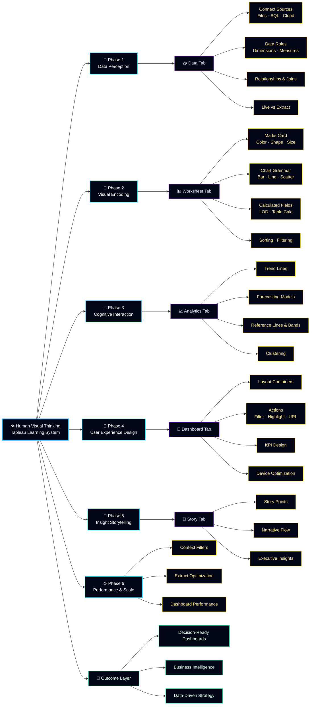

```mermaid
flowchart LR
    %% ========== THEME ==========
    classDef root fill:#020617,stroke:#38bdf8,stroke-width:3px,color:#e5e7eb
    classDef phase fill:#020617,stroke:#22d3ee,stroke-width:2px,color:#f8fafc
    classDef tab fill:#020617,stroke:#a855f7,stroke-width:1.5px,color:#e0e7ff
    classDef step fill:#020617,stroke:#facc15,stroke-width:1.2px,color:#fde68a
    classDef insight fill:#020617,stroke:#34d399,stroke-width:1.5px,color:#d1fae5

    %% ========== ROOT ==========
    A[👁️ Human Visual Thinking<br/>Tableau Learning System]:::root

    %% ========== PHASE 1 ==========
    A --> P1[🧩 Phase 1<br/>Data Perception]:::phase
    P1 --> D1[📥 Data Tab]:::tab
    D1 --> D11[Connect Sources<br/>Files · SQL · Cloud]:::step
    D1 --> D12[Data Roles<br/>Dimensions · Measures]:::step
    D1 --> D13[Relationships & Joins]:::step
    D1 --> D14[Live vs Extract]:::step

    %% ========== PHASE 2 ==========
    A --> P2[🎨 Phase 2<br/>Visual Encoding]:::phase
    P2 --> W1[📊 Worksheet Tab]:::tab
    W1 --> W11[Marks Card<br/>Color · Shape · Size]:::step
    W1 --> W12[Chart Grammar<br/>Bar · Line · Scatter]:::step
    W1 --> W13[Calculated Fields<br/>LOD · Table Calc]:::step
    W1 --> W14[Sorting · Filtering]:::step

    %% ========== PHASE 3 ==========
    A --> P3[🧠 Phase 3<br/>Cognitive Interaction]:::phase
    P3 --> A1[📈 Analytics Tab]:::tab
    A1 --> A11[Trend Lines]:::step
    A1 --> A12[Forecasting Models]:::step
    A1 --> A13[Reference Lines & Bands]:::step
    A1 --> A14[Clustering]:::step

    %% ========== PHASE 4 ==========
    A --> P4[🧩 Phase 4<br/>User Experience Design]:::phase
    P4 --> DB1[🧩 Dashboard Tab]:::tab
    DB1 --> DB11[Layout Containers]:::step
    DB1 --> DB12[Actions<br/>Filter · Highlight · URL]:::step
    DB1 --> DB13[KPI Design]:::step
    DB1 --> DB14[Device Optimization]:::step

    %% ========== PHASE 5 ==========
    A --> P5[📖 Phase 5<br/>Insight Storytelling]:::phase
    P5 --> S1[📖 Story Tab]:::tab
    S1 --> S11[Story Points]:::step
    S1 --> S12[Narrative Flow]:::step
    S1 --> S13[Executive Insights]:::step

    %% ========== PHASE 6 ==========
    A --> P6[⚙️ Phase 6<br/>Performance & Scale]:::phase
    P6 --> P61[Context Filters]:::step
    P6 --> P62[Extract Optimization]:::step
    P6 --> P63[Dashboard Performance]:::step

    %% ========== FINAL INSIGHTS ==========
    A --> R[🚀 Outcome Layer]:::insight
    R --> R1[Decision-Ready Dashboards]:::insight
    R --> R2[Business Intelligence]:::insight
    R --> R3[Data-Driven Strategy]:::insight
```

